- Source: 
- Tags: #Reactive 
---

本文主要记录我在 Reactive Programming 时遇到的线程问题。

### 何时能 block() ？
假如说我们有一个 `query()` 方法，用于请求 https://reqbin.com/echo/get/json ，并将 Response 转成 `Mono<String>`。
```Java
private Mono<String> query(final String hint) {  
    return WebClient.create()  
            .get()  
            .uri("https://reqbin.com/echo/get/json")  
            .retrieve()  
            .bodyToMono(String.class);  
}
```

那么以下代码会因为 `block()` 而出错吗？🤔
```Java
@GetMapping(value = "/mono")  
public Mono<String> getMonoString() {  
    return Mono.just(query("something").log().block());  
}
```

实际上并不会，由 `log()` 输出信息的第 1，2 行可以看出 `block()` 时所在的线程是 `boundedElastic-1` ，而它不是 NonBlockingThread，所以使用 `block()` 去阻塞该线程是 OK 的。
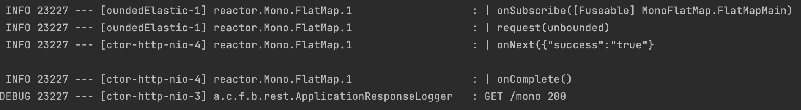

那么如果将代码改成这样呢？🤔
```Java
@GetMapping(value = "/mono")  
public Mono<String> getMonoString() {  
    return query("something unused")  
            .doOnSuccess(ignore -> query("something").log().block());  
}
```

此时请求该接口，可以看到 Server 返回了 500，并提示 "block()/blockFirst()/blockLast() are blocking, which is not supported in thread reactor-http-nio-4"
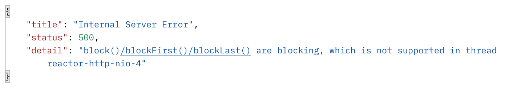

并且通过 `log()` 输出的第 1，2 行，也能得到印证 `block()` 时所在的线程为 `reactor-http-nio-4`，而这是个 NonBlockingThread，因此 `block()` 会抛出异常。
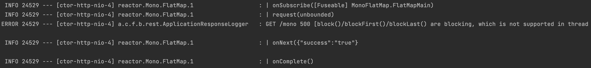

> **Tips**: 可以通过以下代码来判断线程是否为 NonBlockingThread
> 
> ```Java
> Set\<Thread\> threads = Thread.getAllStackTraces().keySet();  
> for (Thread t : threads) {  
> 	System.out.println(t.getName() + " isNonBlockingThread: " + Schedulers.isNonBlockingThread(t));  
>  }
> ```
> 在 Spring Webflux 中，通常只需考虑 `reactor-http-nio`，其名字 nio 也揭示了它 non-blocking 的特性。

### block() 与 subscribe()
如果将以上报错的代码中的 `block()` 改成 `subscribe()`，那么还会报错吗？🤔
```Java
@GetMapping(value = "/mono")  
public Mono<String> getMonoString() {  
    return query("something unused")  
            .doOnSuccess(ignore -> query("something").log().subscribe());  
}
```

答案是不会。那么为什么 `block()` 就会抛出异常呢？`block()` 的源码如下：
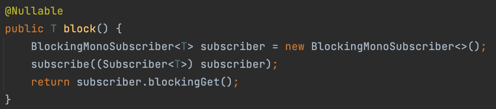

由第二行可以看到，在 `block()` 中也做了 `subscribe()` 操作，这也是为什么在 `.log().block()` 时，输出的日志会有 Subscriber 的 signal。

而在最后一行 `subscriber.blockingGet()` 中，有如下判断：
```Java
if (Schedulers.isInNonBlockingThread()) {  
   throw new IllegalStateException("block()/blockFirst()/blockLast() are blocking, which is not supported in thread " + Thread.currentThread().getName());  
}
```
这便是 `block()` 抛出异常的原因。

### 为何会被 block？
有了以上知识做铺垫后，接下来一起看看我所遇到的问题吧。

假如我用以下代码 build 了一个 cache：
```Java
private Cache<String, Mono> cache2k = new Cache2kBuilder<String, Mono>() {  
    }  
        .loader((key, context, callback) -> {  
            query("something I wanna cache")  
                    .log()  
                    .doOnSuccess(response -> callback.onLoadSuccess(Mono.just(response)))  
                    .subscribe();  
        })  
        .build();
```

它的作用是当我调用 `cache2k.get(key)` 时，会自动触发 `loader()`。
然后 loader 会在  `query("something I wanna cache")` 成功时，将 response 保存到 cache 中。

注意，此处需要 `subscribe()` 的原因是，对于 Publisher 来说，[Nothing happens until you **subscribe**](https://projectreactor.io/docs/core/release/reference/#_from_imperative_to_reactive_programming)。因此为了让 loader 能真正去 query，我需要主动 `subscribe()`。

那么，以下代码能正常运行吗？🤔
```Java
@GetMapping(value = "/mono")  
public Mono<String> getMonoString() {  
    return query("something unused")  
            .flatMap(ignore -> cache2k.get("key"));  
}
```

答案是不行。请求一直处于 pending 状态：
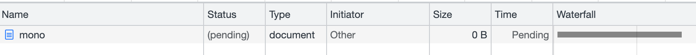

通过查看 `log()` 可以发现 loader 中的 `subscribe()` 发生在 reactor-http-nio-4 线程，而日志中只有 subscribe signal，没有 next, error, complete。
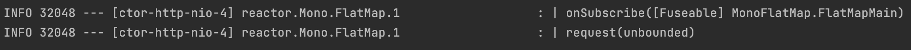

当我们用 VisualVM 等工具查看 JVM 的线程时，确实可以发现 reactor-http-nio-4 相较于其他 reactor-http-nio 线程，它一直处于 Wait 状态。
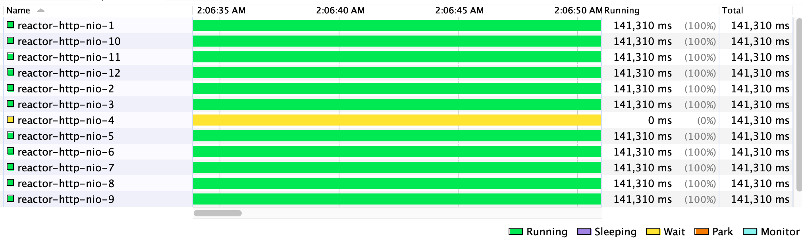

> **Tips**: reactor-http-nio 线程数量是怎么确定的呢？
> [最少 4 个](https://piotrminkowski.com/2020/03/30/a-deep-dive-into-spring-webflux-threading-model/#:~:text=the%20minimum%20number%20of%20worker%20threads%20in%20the%20pool%20is%204.)，最多 `Runtime.getRuntime().availableProcessors()` 个。
> 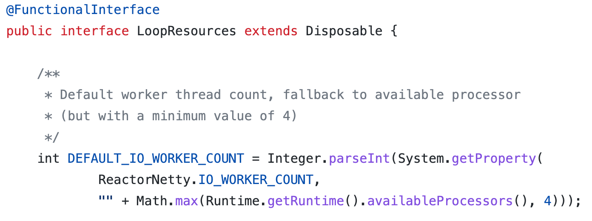

可是我们之前明明验证了在 NonBlockingThread 上 `block()` 会抛出异常，而 `subscribe()` 是可以正常运行的啊。😲

经过一番研究，发现 loader 为了实现 callback 回调，使用了 `CompletableFuture`

好，现在让我们来写一个 demo 验证一下：
```Java
@GetMapping(value = "/mono")  
public Mono<String> getMonoString() {  
    return query("something unused")  
            .map(ignore -> {  
                CompletableFuture<Mono<String>> monoCompletableFuture = new CompletableFuture<>();  
  
                query("something I wanna cache")  
                        .log()  
                        .doOnSuccess(response -> monoCompletableFuture.complete(Mono.just(response)))  
                        .subscribe();  
  
                return monoCompletableFuture;  
            })  
            .flatMap(monoCompletableFuture -> {  
                try {  
                    return monoCompletableFuture.get();  
                } catch (InterruptedException | ExecutionException e) {  
                    throw new RuntimeException(e);  
                }  
            });
```

其中的 `map` 便是仿造 loader 用了 `CompletableFuture`，而 `flatMap` 与原逻辑一样，通过 `get()` 取出结果。

运行后发现，该 demo 的表现与原来一致，请求一直处于 pending 状态，有一个线程会一直处于 Wait 状态。

至此，我们知道了线程被 block 与 `CompletableFuture` 有关，那么原因以及解决方案是什么呢？🤔

先说原因，`CompletableFuture.get()` 可以获取 callback 的值，而 `Mono.block()` 可以获取 Publisher 的值。二者目的相似，但区别在于 `block()` 会通过 `Schedulers.isInNonBlockingThread()` 判断当前线程是否为 NonBlockingThread，如果是，抛出异常，避免阻塞线程。而 `CompletableFuture.get()` 并不会做检查，于是乎，线程被阻塞。

解决方案也很直接，既然 reactor-http-nio 线程是 NonBlockingThread，那换个线程不就好了。我们可以通过 `.subscribeOn()` 来改变 Publisher 的执行线程
```Java
query("something I wanna cache")  
        .log()  
        .subscribeOn(Schedulers.boundedElastic())  
        .doOnSuccess(response -> monoCompletableFuture.complete(Mono.just(response)))  
        .subscribe();
```

然后程序就可以正常运行了。😀

### 如何 debug ?
在 Reactive Programming 时，我们会常想要在 debug 过程能直接看到 Publisher 生成的数据。

例如以下代码：
```Java
@GetMapping(value = "/mono")  
public Mono<String> getMonoString() {  
    return query("something unused")  
            .flatMap(ignore -> query("something"));  
}
```

当我们调用 `query("something unused").block()` 时，可以看到结果，因为此时处于 boundedElastic-1 线程中，它不是 NonBlockingThread。
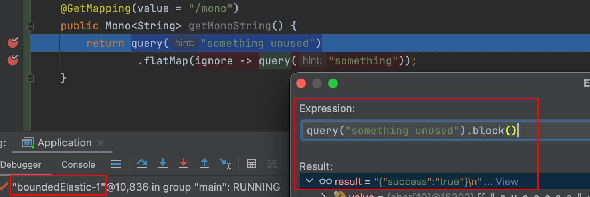

而当我们调用 `query("something").block()` 时，会看到异常信息 "block()/blockFirst()/blockLast() are blocking, which is not supported in thread reactor-http-nio-4"，因为此时处于 reactor-http-nio-4，其为 NonBlockingThread。
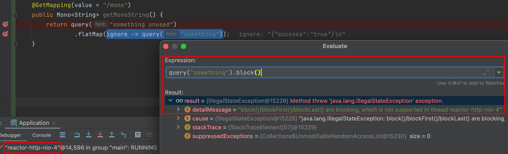

🤔 那么请问 `query("something").toFuture().get()` 可以吗？
🙋 不行，因为 `CompletableFuture.get()` 并不会做检查，线程会被阻塞。

🤔 那么解决方案是什么呢？
🙋 换线程。
```Java
query("something").subscribeOn(Schedulers.boundedElastic()).toFuture().get()
```
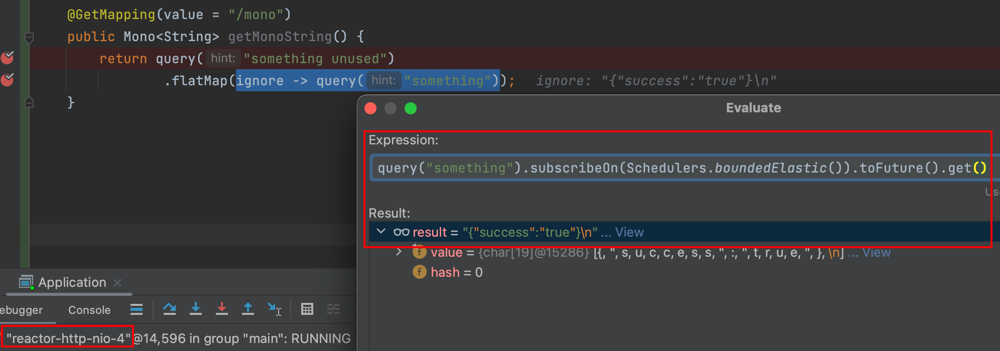

本次分享到此结束。本文仅为了记录下自己在 Reactor 线程模型中进一寸的欢喜，如果以上有理解不到位或者有误的地方，还望各位不吝赐教。🤗
