- Source: 
- Tags: #Java #Plugin
---

## 背景
试想这么一个场景，你的程序会做一件简单的 scatter-gather 的事，即发送多个请求，然后聚合这些请求的结果，并将其返回。

举个例子，你将发送 3 个请求，其中，请求 A 返回结果 `[1]`，请求 B 返回结果为空，请求 C 返回结果 `[2]`，那么最终你需要返回聚合后的结果 `[1,2]`。
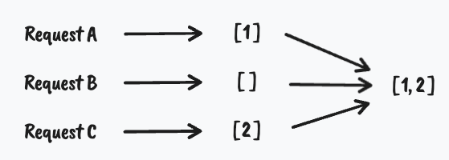

而在该过程，每个请求返回什么数据，是程序需要去考虑的事情，作为消费者的你并不关心，你只关心程序最终输出的结果。

可是对于一名需要 debug 的程序员来说，我在知道最终结果是 `[1,2]` 之后，还需要搞清楚是哪个请求返回的 `[1]` 与 `[2]`。

本来呢，此事也很简单。不就是把每个 URL 都打开来看看就一目了然了嘛。然而不巧的是，URL 中居然带了括号 `()`，导致在 IntelliJ 的 console 中显示效果如下：
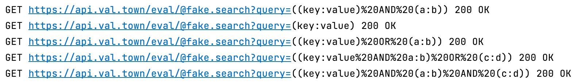

以上是程序打印的日志，其格式可以简单认为是 `GET {URL} 200 OK`。观察可知，该 URL 左半部分是蓝色可点击的超链接状态，而右半部分则是 plain text。这就导致当你需要打开该链接时，没有办法一键点开，而是需要先拖拽鼠标选中该 URL，复制粘贴，然后才能在浏览器中打开。

该 workflow 可以用以下伪代码描述：
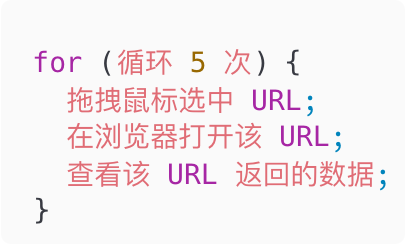

那么本文将介绍我是如何优化该 workflow 的。

## 数据准备（选读）
本节主要介绍我为这篇文章所做的数据准备。

### Server
首先，我需要一个 API，当我请求该 API 时，它要么返回数据，要么返回空数组。

我选择了在 [Val Town](https://www.val.town/) 部署我的脚本，用来模拟接口。

> **Note**:
> Val Town is a website for writing, running, and deploying scripts.

脚本内容如下：
```JavaScript
export search = (params) => {
  const len = Object.values(params).join("").length;
  return len % 2 == 0 ? [] : [{ id: len }];
};
```

其中不需要在意 `len % 2 == 0` 该条件判断，我只是需要有一个分支，能够返回 `[]` 或者 `[{ id: len }]` 而已。

最终当你请求 https://api.val.town/eval/@fake.search?query=(key:value) 时，会返回
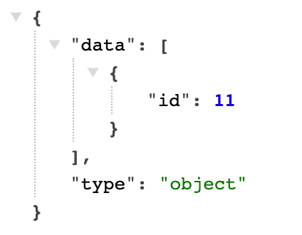

当你请求 https://api.val.town/eval/@fake.search?query=((key:value)%20OR%20(a:b)) 时，会返回
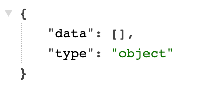

### Code
代码分为 4 部分

- User 类
```Java
public class User {  
    String id;  
  
    public User(String id) {  
        this.id = id;  
    }  
  
    public String getId() {  
        return id;  
    }  
}
```

- LoggingInterceptor，用于打印 `GET {URL} 200 OK` 的日志
```Java
@Component  
public class LoggingInterceptor implements ExchangeFilterFunction {  
    private static final Logger log = LoggerFactory.getLogger(LoggingInterceptor.class);  
  
    @Override  
    public Mono<ClientResponse> filter(ClientRequest request, ExchangeFunction next) {  
        return next.exchange(request)  
                .doOnSuccess(response -> {  
                    String logMessage = String.format("%s %s %s", request.method(), request.url(), response.statusCode());  
                    log.info(logMessage);  
                });  
    }  
}
```

- Connector，用于发送请求
```Java
@Component  
public class Connector {  
    private final WebClient webClient;  
  
    public Connector(LoggingInterceptor loggingInterceptor) {  
        this.webClient = WebClient.builder()  
                .filter(loggingInterceptor)  
                .build();  
    }  
  
    public Flux<User> getUser(String uri) {  
        return webClient.get()  
                .uri(uri)  
                .retrieve().bodyToMono(JsonNode.class)  
                .flatMapMany(jsonNode -> fromIterable(jsonNode.path("data")))  
                .map(jsonNode -> new User(jsonNode.get("id").asText()));  
    }  
}
```

- Controller，用于聚合请求结果
```Java
@RestController  
public class Controller {  
    @Autowired  
    private Connector connector;  
  
    @GetMapping("/users")  
    public Mono<ResponseEntity<List<User>>> getUsers() {  
        return Flux.just(  
                        "https://api.val.town/eval/@fake.search?query=(key:value)",  
                        "https://api.val.town/eval/@fake.search?query=((key:value) AND (a:b))",  
                        "https://api.val.town/eval/@fake.search?query=((key:value) OR (a:b))",  
                        "https://api.val.town/eval/@fake.search?query=((key:value AND a:b) OR (c:d))",  
                        "https://api.val.town/eval/@fake.search?query=((key:value) AND (a:b) AND (c:d))"  
                ).flatMap(connector::getUser)  
                .collectList()  
                .map(users -> ResponseEntity.ok().body(users));  
    }  
}
```

> **Note**:
> 以上代码已上传至 [demo-for-clickable-hyperlink](https://github.com/wu-jinpeng/demo-for-clickable-hyperlink)。

## 首次优化
正常来说，IntelliJ console 中的 URL 都是可点击的超链接，结果因为 URL 中带了括号 `()`，导致出现异常。

猜测是因为括号导致相关正则表达式无法被匹配。

我先是查了一下如何改 IntelliJ 的正则，发现了 [consoleLink](https://github.com/siosio/consoleLink) 和 [output-link-filter](https://github.com/minchenkov/output-link-filter) 这两款别人写的 plugins，但是它们的正则仍然不满足要求

于是我决定自己写一个 plugin，不仅实现让 URL 能完整 clickable，还要将 URL decode。

### Clickable
要让 URL 能完整 clickable，只需简单三步走：
1. 实现 `Filter` interface
```Java
public class ConsoleHyperlinkFilter implements Filter {  
    public static final Pattern URL_PATTERN = Pattern.compile("(?<=GET )https?://.+(?= 200 OK)");  
  
    @Override  
    public @Nullable Result applyFilter(@NotNull String line, int entireLength) {  
        int startPoint = entireLength - line.length();  
        Matcher matcher = URL_PATTERN.matcher(line);  
        if (matcher.find()) {  
            return new Result(startPoint + matcher.start(), startPoint + matcher.end(), new OpenUrlHyperlinkInfo(matcher.group()));  
        }  
        return null;  
    }  
}
```

此处的正则表达式匹配的是 `GET {URL} 200 OK`，之所以限制得这么严格，是因为我并不想去覆盖 IntelliJ 原有的正则匹配，我只希望它能互补即可。

2. 实现 `ConsoleFilterProvider` interface
```Java
public class ConsoleHyperlinkFilterProvider implements ConsoleFilterProvider {  
    @Override  
    public Filter @NotNull [] getDefaultFilters(@NotNull Project project) {  
        return new Filter[]{ new ConsoleHyperlinkFilter() };  
    }  
}
```

3. 添加 provider 到 plugin.xml
```XML
<extensions defaultExtensionNs="com.intellij">  
    <consoleFilterProvider implementation="xxx.ConsoleHyperlinkFilterProvider" order="first" />  
</extensions>
```

此处的 `order` 需要为 `first` ，因为每个 URL 只会被注册一次 `OpenUrlHyperlinkInfo`，这样才能实现
- 若 URL 中带括号，走我的实现逻辑
- 否则，走 IntelliJ 原本的实现逻辑

### Decode
实现 decode 能够让 console 中的 URL 由 `https://api.val.town/eval/@fake.search?query=((key:value)%20OR%20(a:b))` 显示为 `https://api.val.town/eval/@fake.search?query=((key:value) OR (a:b))`。

也是类似的三步走：
1. 实现 `InputFilter` interface
```Java
public class ConsoleHyperlinkInputFilter implements InputFilter {  
    @Override  
    public @Nullable List<Pair<String, ConsoleViewContentType>> applyFilter(@NotNull String text, @NotNull ConsoleViewContentType contentType) {  
        Matcher matcher = URL_PATTERN.matcher(text);  
        if (matcher.find()) {  
            String url = matcher.group();  
            String decodedUrl = URLDecoder.decode(url, StandardCharsets.UTF_8);  
  
            return List.of(new Pair<>(text.replace(url, decodedUrl), contentType));  
        }  
        return null;  
    }  
}
```

2. 实现 `ConsoleInputFilterProvider` interface
```Java
public class ConsoleHyperlinkInputFilterProvider implements ConsoleInputFilterProvider {  
    @Override  
    public InputFilter @NotNull [] getDefaultFilters(@NotNull Project project) {  
        return new InputFilter[]{ new ConsoleHyperlinkInputFilter() };  
    }  
}
```

3. 添加 provider 到 plugin.xml
```XML
<extensions defaultExtensionNs="com.intellij">   
    <consoleInputFilterProvider implementation="xxx.ConsoleHyperlinkInputFilterProvider" order="last" />  
</extensions>
```

最终实现效果如下：
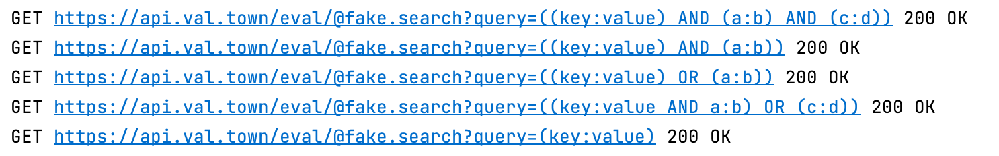

在写 IntelliJ Plugin 过程中，发现了一个 `UrlFilter`
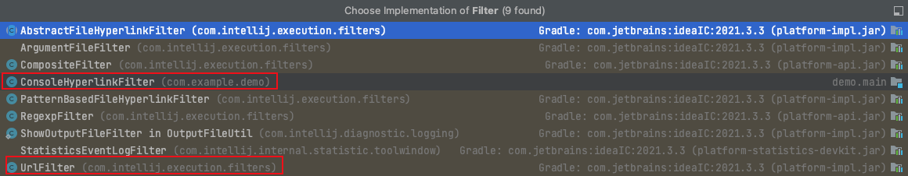

它引用的 `URLUtil.URL_PATTERN` 正是我们想找的原正则，其值如下：
```Java
Pattern.compile("\\b(mailto:|(news|(ht|f)tp(s?))://|((?<![\\p{L}0-9_.])(www\\.)))[-A-Za-z0-9+$&@#/%?=~_|!:,.;]*[-A-Za-z0-9+$&@#/%=~_|]")
```

在 [regex101](https://regex101.com/)  中确实可以发现它匹配不了带 `()` 的 URL
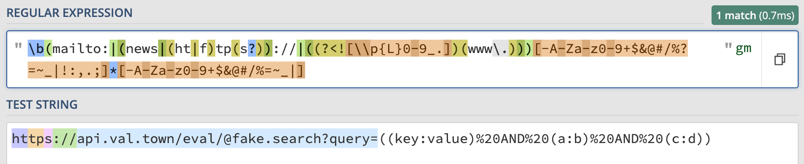

总而言之，在经过第一次优化后，workflow 更新如下
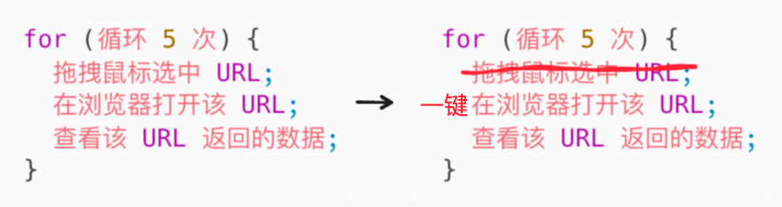

> **Note**:
> 该 Plugin 代码已上传至 [intellij-platform-plugin-clickable-hyperlink](https://github.com/wu-jinpeng/intellij-platform-plugin-clickable-hyperlink)
> 如需安装至 IntelliJ，请参考 [Installation](https://github.com/wu-jinpeng/intellij-platform-plugin-clickable-hyperlink#installation)

## 再次优化
借助 IntelliJ Plugin 我们摆脱了拖拽鼠标选中 URL 的繁琐操作。那么，还能不能更进一步呢？

既然在日志中能看到 `200 OK` 的 status code，意味着 response body 应该也是能获取的。如果我在打印日志时，判断 response body 中是否有数据，岂不是就能避免点开每个 URL？！🤔

我们可以将 [demo-for-clickable-hyperlink](https://github.com/wu-jinpeng/demo-for-clickable-hyperlink) 中的 `LoggingInterceptor` 代码更新如下：
```Java
@Component  
public class LoggingInterceptor implements ExchangeFilterFunction {  
    private static final Logger log = LoggerFactory.getLogger(LoggingInterceptor.class);  
  
    @Override  
    public Mono<ClientResponse> filter(ClientRequest request, ExchangeFunction next) {  
        return next.exchange(request)  
                .flatMap(response -> response.bodyToMono(String.class)  
                        .doOnNext(responseBody -> {  
                            JsonNode jsonNode;  
                            try {  
                                jsonNode = new ObjectMapper().readTree(responseBody);  
                            } catch (JsonProcessingException e) {  
                                throw new RuntimeException(e);  
                            }  
  
                            ArrayNode data = (ArrayNode) jsonNode.get("data");  
                            String logMessage = String.format("%s %s %s %s", request.method(), request.url(), response.statusCode(), data.isEmpty() ? "❌" : "✅");  
                            log.info(logMessage);  
                        })  
                        .flatMap(responseBody -> Mono.just(response.mutate().body(responseBody).build())));  
    }  
}
```

再结合之前实现的 Plugin，最终效果如下：
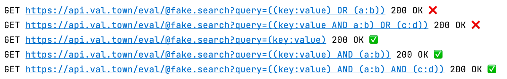

至此，workflow 也完成了再一次优化
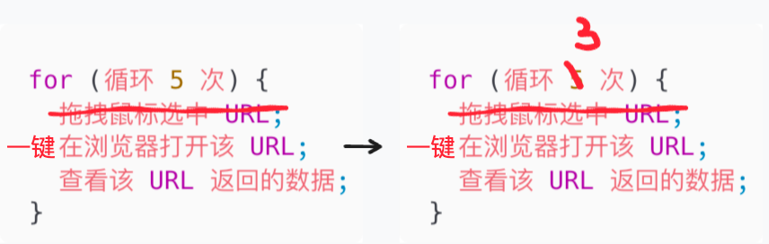

> **Note**:
> 优化后的代码已上传至 [demo-for-clickable-hyperlink](https://github.com/wu-jinpeng/demo-for-clickable-hyperlink/tree/refactor-logging-interceptor) 中的 `refactor-logging-interceptor` branch

本次分享到此结束。本文仅为了记录自己在优化日常工作 workflow 过程中进一寸的欢喜，如果以上有理解不到位或者有误的地方，还望各位不吝赐教。🤗
